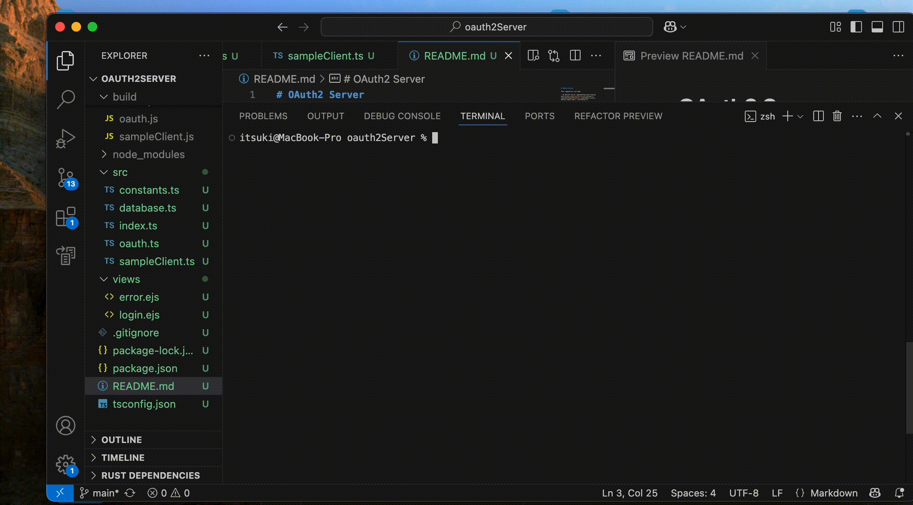

# OAuth2 Server

This repository includes

- An OAuth2 Server implemented with Express and [@node-oauth/oauth2-server](https://node-oauthoauth2-server.readthedocs.io/en/master/index.html), conforming to [specifications defined by OAuth 2.1 IETF DRAFT](https://datatracker.ietf.org/doc/html/draft-ietf-oauth-v2-1-12)

- A simple client for testing using [openid-client](https://github.com/panva/openid-client/tree/main).

For more details, please refer to my article (NodeJs/Typescript: OAuth2 Server with Express (Specification & Implementation))[https://medium.com/@itsuki.enjoy/nodejs-typescript-oauth2-server-with-express-specification-implementation-de14ed081182].

## Server
A server supporting authorization code grant and refresh token grant.

**NOTE**: For simplification, instead of an actual database, runtime variables are used in the example to store code/token/client/user data.

### Protocol Endpoints
Basic implementations for the following endpoints are provided conforming to the IETF specifications.

- Authorization endpoint
- Token endpoint (for both authorization code exchange and refresh token exchange)
- Revocation endpoint for revoking access tokens and refresh tokens
- `/.well-known/oauth-authorization-server` for Server Metadata discovery

### Other Endpoints
- Sample protected endpoint that perform user authentication
- Error endpoint to display errors related to client's `redirect_uri`

## Sample Client

A simple client implemented using [openid-client](https://github.com/panva/openid-client/tree/main) to conform that the server implementations are indeed conforming to the specifications.

The client will
- Discover the server to find out the endpoint URIs
- Start a local server to receive server callback
- Open the browser with the `authorization_endpoint` URI
- Wait for the authorization to complete and code deliver to the callback endpoint
- Exchange code for token
- Get new access token by using refresh token 
- Call the protected resource with the access token
- Revoke token
- Shut down!

## Run the Example
- `npm install` to install the dependencies
- `npm run dev` to
    - build the project
    - start the server
    - add some dummy data
    - run the client for testing